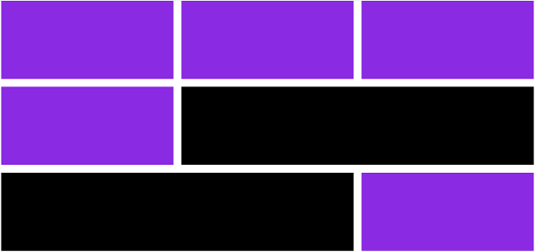
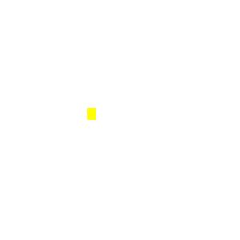
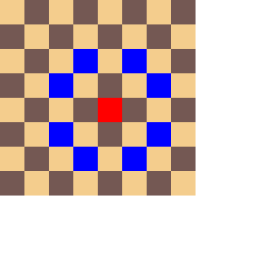
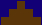
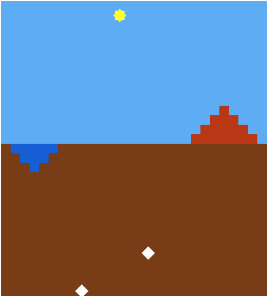
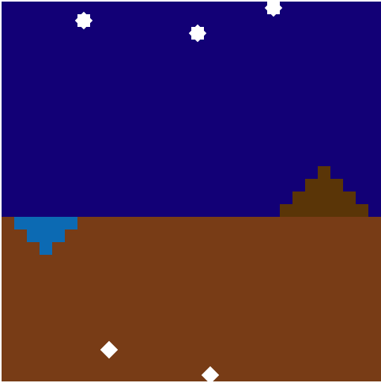

# Чемпионат по программированию: Фронтенд-разработка — финал

Разбор задач с финала [чемпионата по программированию Яндекс](https://yandex.ru/championship/) по направлению Фронтенд-разработки (26 окт 2019).

> 👀 Чтобы на главной странице репозитория не спойлерить решения, ниже представлен лишь список задач с их условиями. Вы можете попробовать решить их самостоятельно и сравнить свои решения с моими. Ссылка на решение каждой задачи указана под ее описанием.

> ⚠️ Предоставленные решения не являются официальными. Я просто участник, который разобрался со всеми заданиями и решил поделиться со своими вариантами решения после проведения соревнования.
> 
> 💡 Если у вас есть комментарии к предложенным решениям или альтернативные (более рациональные) способы решения, пишите на [📧почту](mailto:shevchux@gmail.com) или делайте пулл реквест.
___

#### Список задач

* [Задача А.](#task-A) Асинхронный API из параллельной вселенной. [С решением »](tasks/A/README.md)
* [Задача B.](#task-B) Будни стажера. [С решением »](tasks/B/README.md)
* [Задача C.](#task-C) Идеальные прямоугольники. [С решением »](tasks/C/README.md)
* [Задача D.](#task-D) Ход конём. [С решением »](tasks/D/README.md)
* [Задача E.](#task-E) Рельеф планеты Х. [С решением »](tasks/E/README.md)
* [Задача F.](#task-F) Космические Рейнджеры. [С решением »](tasks/F/README.md)
___

<a name="task-A"><h2>Задача А. Асинхронный API из параллельной вселенной (15 баллов)</h2></a>

Ваш коллега-разработчик из параллельной вселенной прислал вам свою новую библиотеку для управления космическим кораблем. Т.к. космический корабль штука сложная, то и API у библиотеки довольно «развесистый», точное число методов неизвестно, документации, разумеется, нет. Зато известно, что в параллельной вселенной люди ходят по потолку, спят днём, работают ночью, а ещё используют только асинхронные функции и всегда передают callback первым аргументом. Странные ребята! У нас на Земле уже давно все на промисах пишут. Однако библиотеку нужно интегрировать в проект. Поэтому вам поступила задача написать обёртку, которая будет предоставлять тот же API, но на промисах.

### Формат ввода
Пример исходного API:
``` js
const api = {
  a: {
    b: {
      c: callback => setTimeout(() => callback(null, 'hello'), 100)
    }  
  },
  aa: {
    bb: (callback, x, y) => setTimeout(() => callback(null, x + y), 200)
  }
};
```

### Формат вывода
Отправьте решение в виде:
``` js
/**
 * @param {Object} api - исходное API
 * @returns {Object}
 */
module.exports = function promisify(api) {
  // ...
  return promisedApi;
};
```
Пример использования:
``` js
const promisedApi = promisify(api);
promisedApi.a.b.c()
  .then(res => console.log(res)); // => 'hello'
```

### Примечания

* обёртка должна возвращать rejected promise в случае ошибки при вызове исходного API, callback всегда принимает ошибку первым аргументом:
callback(error, data)
* в исходном API могут встречаться константы (числа, строки и булевые), их нужно возвращать как есть:
```
api.foo.myConst = 1;  
promisedApi.foo.myConst === 1;
```
* инициализация обёртки должна быть «ленивой»: в исходном API может быть большое количество неймспейсов, и обращаться к ним нужно по мере использования.

### Решение

Решение задачи [здесь](tasks/A/README.md).

___

<a name="task-B"><h2>Задача B. Будни стажера (15 баллов)</h2></a>

В команде Яндекса работает стажёр Степан. Сроки уже поджимают, а он не успевает с вёрсткой страниц. Помогите Степану сверстать одну из них по макету из этой задачи. 

При вёрстке не должно быть отступов от левого и верхнего края страницы. Также нельзя использовать изображения. Вот макет:



Как видите, макет состоит из плиток двух размеров: стандартного и двойного. Стандартная плитка занимает 1/3 ширины экрана, двойная — 2/3. Высота плитки фиксированная - 200px. Расстояние между плитками 20 пикселей.

Цвет бекграунда стандартной плитки `#8a2be2`, цвет двойной `#000`.

В результате у вас должна получиться HTML-страница с вёрсткой для макета. Размер страницы не должен превышать 10 КБ.

### Примечание

В шаблонах можно писать только вёрстку и стили — JavaScript и изображения использовать нельзя.

### Решение

Решение задачи [здесь](tasks/B/README.md).

___


<a name="task-C"><h2>Задача C. Идеальные прямоугольники (40 баллов)</h2></a>

Боб — художник-экспрессионист. Все его работы представляют собой цветные строго вертикальные прямоугольники на белом фоне.

Недавно его работы опубликовали на сайте известного журнала Top Art. Боб решил разглядеть свои полотна поближе, увеличил масштаб страницы и пришел в ужас от расплывшихся углов и нечётких краёв его идеальных прямоугольников.

Будучи человеком обстоятельным, он изучил проблему и решил свои шедевры сконвертировать в HTML, чтобы под любым углом и в любом масштабе линии оставались идеальными. Для выполнения задуманного он выбрал вас.

Напишите для него сервис, который сможет генерировать html из картинок.

### Формат ввода

На вход подаётся строка, которая содержит картинку в base64.

### Формат вывода

Верните функцию **traceImage**, которая на вход принимает ссылку на картинку, а возвращает промис, который резолвится со строкой. В строке должна быть вёрстка, которая повторяет эту картинку.

Отправьте решение в виде:
``` js
/**  
 *  
 * @param {String} imageSrc - base64 картинки, например ’data:image/png;base64,iVBORw0KGgoAAAANSUhEUgAA...’  
 * @returns {Promise}  
 */  
function traceImage(imageSrc) {  
 // Ваше решение  
}
```
### Примечания
* Картинка может быть любого размера
* Картинка не прозрачная
* Цвет пустых пикселей — белый (r, g, b): (255, 255, 255)
* На картинке изображён 1 цветной непрозрачный прямоугольник
* Все линии горизонтальные или вертикальные
* Код выполняется в браузере

### Пример
Дана картинка строкой в base64 (в том виде, в котором она будет передаваться в функцию): [пример Base64](tasks/C/input-example.txt).



Для такой картинки можно сгенерировать строку:

``` html
<div>  
    <div style="  
        position: absolute;  
        width: 11px;  
        height: 15px;  
        top: 135px;  
        left: 109px;  
        background-color: rgb(255, 255, 0);  
    "></div>  
</div>
```

### Решение

Решение задачи [здесь](tasks/C/README.md).
___

<a name="task-D"><h2>Задача D. Ход конём (40 баллов)</h2></a>

Геннадий - интеллектуал. Он любит знакомиться с интересными людьми. Но будучи человеком осмотрительным и недоверчивым, делает он это только в интернете. Недавно Геннадий обнаружил, что сопоставимых по IQ собеседников можно отыскать на шахматном форуме, но вот беда - в шахматы играть Геннадий не умеет, а все обучаторы основаны на javascript-е, который Геннадий осмотрительно отключает, чтобы избежать вероятности подцепить вирус.

Чтобы помочь Геннадию - предлагаем сделать обучатор для игры в шахматы без javascript, который будет показывать, как ходит конь. Обучатор должен выглядеть как шахматная доска. Кликаешь по клетке - тебе показывают, куда с этой клетки может пойти конь.

### Формат ввода

html-документ, при загрузке которого рисуется шахматная доска

### Формат вывода

Задание будет протестировано в реальном браузере (Chrome 77).

В браузере будет загружен ваш html-документ. Робот кликает в различные ячейки шахматного поля и снимает скриншоты после кликов.

Скриншоты должны соответствовать эталонным

### Пример



### Примечание

* Реализация на CSS и HTML. Javascript использовать нельзя.
* Вся верстка должна быть квадратной, без теней, градиентов, скруглений и т.п.
* Ширина и высота ячейки - 30 пикселей
* Шахматное поле находится на странице слева сверху, без отступов
* Цвет выделенной ячейки #ff0000
* Цвет ячейки, на которую может ходить фигура #0000ff
* Цвет светлой ячейки #f4cd8d
* Цвет темной ячейки #745853
* Левая верхняя ячейка светлая
* Изначально ни одна ячейка не выделена
* Выделение происходит по клику в конкретную ячейку и сохраняется до следующего клика

### Решение

Решение задачи [здесь](tasks/D/README.md).
___

<a name="task-E"><h2>Задача E. Рельеф планеты Х (60 баллов)</h2></a>

В 2050 году учёные из МКС начали получать особенные сигналы из космоса с массивами чисел. Учёные предполагают, что некая инопланетная цивилизация передаёт в массивах рельеф части своей планеты.

Вам предложили присоединиться к исследованию зашифрованного сигнала, чтобы помочь воссоздать эту предположительную местность.

Описание прилагается:

Значения h описывают высоты (h > 0), низины (h < 0) и уровень моря (h = 0) в пикселях (px) кратные 10. (далее в h, пиксели будут опускаться).

Площади (S) объектов определяются суммой абсолютных значений элементов. ([–10,–30,–10], S=50)

Ширина одной клетки `=10px`

* Солнце расположено в промежутке 100 < h < 150. Если его нет, то тема сменяется на ночную. Цвет: `#fff000` 
* Звёзды расположены на высоте h ≥ 150. Видны только ночью. Цвет: `#ffffff` 
* Горы — положительно определённые палиндромы нечётной длины > 1 с вершиной 30 ≤ h ≤ 100. ([0,10,30,10,0]). Нужно найти и нарисовать самую большую гору по площади (остальные возвышенности не рисуем). Цвет на день / ночь: `#bb3300` / `#5b3500`  
* Озёра — отрицательно определённые палиндромы нечётной длины > 1 с глубиной −30 ≥ h ≥ -100. ([0,–10,–30,–10,0]). Нужно найти и нарисовать самое большое озеро по площади (остальные низменности не рисуем). Цвет на день / ночь: `#0f5ed6` / `#036bb5`  
* Алмазы расположены на глубине h < −100, должны граничить с землёй (h ≥ 0). [0,–110,10]. Клетка перевёрнута на 45°. Цвет: `#ffffff` 
* Цвет дневного неба: `#5baef7`
* Цвет звёздного неба: `#120078`
* Цвет земли: `#793b0f`

Учёные хотят, чтобы вы графически представили такой массив в виде прямоугольников одинаковой ширины.

### Примеры

```
День: [0,–10,–20,–30,–20,–10,0,10,–160,0,40,0,140,150,0,–120,0,–20,0,20,10,20,30,40,30,20,10,0]
```


```
Ночь: [0,–10,–20,–30,–20,–10,160,10,–110,0,40,0,90,0,0,150,–130,0,–20,0,20,170,10,20,30,40,30,20,10,0]
```


Решение представляет собой функцию, возвращющую объект со строками `{script,style}`, которые будут добавляться в HTML-документ с единственным элементом в теле `<div class="world"></div>`.

Задача решается при помощи разметки, без использования canvas.

``` html
<!DOCTYPE html>  
<html lang="en">  
  <head>  
    <meta charset="UTF-8">  
    <style type="text/css">`${style}`</style>  
  </head>  
  <body>  
    <div class="world"></div>  
    <script type="text/javascript">`${script}`</script>  
  </body>  
</html>
```

Пришлите решение в таком виде:

``` js
module.exports = function(arr) {  
    let script,style;  
    ...  
    return {  
        script: script,  
        style: style  
    };  
}
```

### Примечания

* `script` и `style` добавляются в чистом виде без тегов,
* ширина блока (класса) `world` должна быть равна произведению количества элементов на ширину одной клетки (10px). Например, для массива [0,10,150,10,–150] ширина равняется 5×10px = 50px
* высота блока (класса) `world` должна быть равна сумме абсолютных значений максимального и минимального элементов. Например, для массива [0,10,150,10,–150] высота равняется |150| + |–150| = 300px,
* горы и озёра не обязательно должны граничить с уровнем моря (h=0)
* горы и озёра монотонно убывают и возрастают от центра
* для алмаза [–150], h = −150 определяет нижнюю грань (т.е. нужно верстать с –140 по –150)
* тесты на скриншоты будут прогоняться относительно класса `world`
 
### Решение

Решение задачи [здесь](tasks/E/README.md).
___

<a name="task-F"><h2>Задача F. Космические Рейнджеры (60 баллов)</h2></a>

В параллельной вселенной человечество научилось путешествовать к соседним звёздам.

Для этого построили «Звёздные ускорители» (ЗУ), которые могут перебрасывать корабль на несколько световых лет в одну из четырёх сторон (вперед/назад/вправо/влево). Да, параллельная вселенная двухмерная, не спрашивайте.

ЗУ отличаются мощностью от 1 до 9 — и могут использовать как всю, так и только часть своей мощности для перемещения корабля. 
Услуга эта дорогая, но, что удивительно, цена фиксирована и не зависит от затраченной мощности. 

Таким образом, выгодно строить маршрут так, чтобы количество межпространственных прыжков было минимальным.

Вы попали в эту вселенную и только что купили себе новенький космический корабль с последней версией местных звёздных карт. 
Интерфейс заботливо показывает вам фрагмент галактики с проложенным по нему оптимальным маршрутом.

```
From: 0:2  
To: 8:7  
0:2 -> 0:3 -> 4:3 -> 4:7 -> 8:7  
===============================================================================  
 1   1   4   2   5       5   4   2   2  
 
             1   5       5   2   1   4  
 
[1]      3   1       5   5   2   5   3  
 |  
[5]--3---5---2--[5]      1   2   2   5  
                 |  
 1   3       5   |   3   1   4   5  
                 |  
 1   5   5   4   1   5       5   5   2  
                 |  
 2   2   2       1   1   4   1       3  
                 |  
 1   1   3   3  [5]------3---5--[1]  5  
 
 1   5   4       2   5   1   3   1   5  
 
 1   1   4   5       2   4           3
```

К сожалению, в очередном обновлении разработчики допустили ошибку, из-за чего модуль расчёта пути сломался. Вам предстоит починить его.

В качестве решения этого задания отправьте файл `.js`, в котором объявлена функция `pathFinder`:

``` js
function pathFinder(input) {  
    // ...  
}
```

### Формат ввода

В параметре `input` в функцию `pathFinder` приходит строка следующего формата:

```
<x1>:<y1>
<x2>:<y2>
<map line> 
...
<map line>
```

* `<x1>:<y1>` — начальная координата пути, например, 0:2
* `<x2>:<y2>` — конечная координата пути, например, 8:7
* `<map line>` — строка карты выражена последовательностью цифр от 0 до 9

Каждая цифра на карте - это то, на сколько шагов можно переместиться из этой точки. Например, из точки с значением 1 можно перейти только на соседние 4 точки. 

Количество цифр в каждой строке карты одинаковое. 

Количество строк на карте совпадает с количеством цифр в строках. 
Максимальный размер карты: 40 x 40.

### Формат вывода

Функция должна вернуть массив со списком оптимальных путей. 
Порядок оптимальных путей в массиве не важен. 

Пустой массив, если невозможно добраться до конечной точки.

#### Пример 1

Ввод:

```
2:3 
4:4  
00014  
30020  
00000  
70100  
11100
```

Вывод:

```
[["2:3","2:4","1:4","0:4","0:3","0:1","3:1","3:0","4:0","4:4"]]
```
#### Пример 2

Ввод:

```
0:2  
8:7  
0515320501  
3150514510  
0102010523  
5510001000  
1402152200  
0310530201  
0551451213  
4101452055  
0252411510  
4110045253
```

Вывод:

```
[]
```

#### Пример 3

Ввод:

```
2:3  
3:0  
2012  
3001  
7000  
1920
```

Вывод:

```
[["2:3","0:3","0:2","0:0","2:0","3:0"],["2:3","0:3","0:2","0:1","3:1","3:0"]]
```
### Примечания

* Решение будет проверяться в браузере (Chrome 78).
* Можно использовать синтаксис до es2018 включительно.

### Решение

Решение задачи [здесь](tasks/F/README.md).