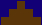
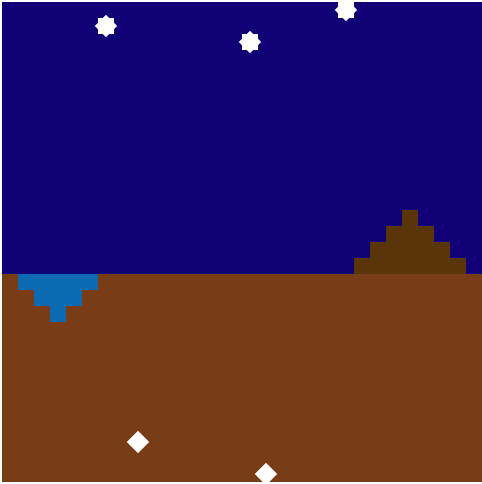

[« к списку заданий](../../README.md) · [A](../A/README.md) · [B](../B/README.md) · [C](../C/README.md) · [D](../D/README.md) · **[E](../E/README.md)** · [F](../F/README.md)

------

<a name="task-E"><h2>Задача E. Рельеф планеты Х (60 баллов)</h2></a>

В 2050 году учёные из МКС начали получать особенные сигналы из космоса с массивами чисел. Учёные предполагают, что некая инопланетная цивилизация передаёт в массивах рельеф части своей планеты.

Вам предложили присоединиться к исследованию зашифрованного сигнала, чтобы помочь воссоздать эту предположительную местность.

Описание прилагается:

Значения h описывают высоты (h > 0), низины (h < 0) и уровень моря (h = 0) в пикселях (px) кратные 10. (далее в h, пиксели будут опускаться).

Площади (S) объектов определяются суммой абсолютных значений элементов. ([–10,–30,–10], S=50)

Ширина одной клетки `=10px`

* Солнце расположено в промежутке 100 < h < 150. Если его нет, то тема сменяется на ночную. Цвет: `#fff000` 
* Звёзды расположены на высоте h ≥ 150. Видны только ночью. Цвет: `#ffffff` 
* Горы — положительно определённые палиндромы нечётной длины > 1 с вершиной 30 ≤ h ≤ 100. ([0,10,30,10,0]). Нужно найти и нарисовать самую большую гору по площади (остальные возвышенности не рисуем). Цвет на день / ночь: `#bb3300` / `#5b3500`  
* Озёра — отрицательно определённые палиндромы нечётной длины > 1 с глубиной −30 ≥ h ≥ -100. ([0,–10,–30,–10,0]). Нужно найти и нарисовать самое большое озеро по площади (остальные низменности не рисуем). Цвет на день / ночь: `#0f5ed6` / `#036bb5`  
* Алмазы расположены на глубине h < −100, должны граничить с землёй (h ≥ 0). [0,–110,10]. Клетка перевёрнута на 45°. Цвет: `#ffffff` 
* Цвет дневного неба: `#5baef7`
* Цвет звёздного неба: `#120078`
* Цвет земли: `#793b0f`

Учёные хотят, чтобы вы графически представили такой массив в виде прямоугольников одинаковой ширины.

### Примеры

```
День: [0,–10,–20,–30,–20,–10,0,10,–160,0,40,0,140,150,0,–120,0,–20,0,20,10,20,30,40,30,20,10,0]
```


```
Ночь: [0,–10,–20,–30,–20,–10,160,10,–110,0,40,0,90,0,0,150,–130,0,–20,0,20,170,10,20,30,40,30,20,10,0]
```


Решение представляет собой функцию, возвращющую объект со строками `{script,style}`, которые будут добавляться в HTML-документ с единственным элементом в теле `<div class="world"></div>`.

Задача решается при помощи разметки, без использования canvas.

``` html
<!DOCTYPE html>  
<html lang="en">  
  <head>  
    <meta charset="UTF-8">  
    <style type="text/css">`${style}`</style>  
  </head>  
  <body>  
    <div class="world"></div>  
    <script type="text/javascript">`${script}`</script>  
  </body>  
</html>
```

Пришлите решение в таком виде:

``` js
module.exports = function(arr) {  
    let script,style;  
    ...  
    return {  
        script: script,  
        style: style  
    };  
}
```

### Примечания

* `script` и `style` добавляются в чистом виде без тегов,
* ширина блока (класса) `world` должна быть равна произведению количества элементов на ширину одной клетки (10px). Например, для массива [0,10,150,10,–150] ширина равняется 5×10px = 50px
* высота блока (класса) `world` должна быть равна сумме абсолютных значений максимального и минимального элементов. Например, для массива [0,10,150,10,–150] высота равняется |150| + |–150| = 300px,
* горы и озёра не обязательно должны граничить с уровнем моря (h=0)
* горы и озёра монотонно убывают и возрастают от центра
* для алмаза [–150], h = −150 определяет нижнюю грань (т.е. нужно верстать с –140 по –150)
* тесты на скриншоты будут прогоняться относительно класса `world`


Решение
------
<sup>[Файл с решением](answer/index.html).</sup>

По заданию экспорт-функция возвращает стили и скрипты в текстовом формате. Написать стили в строке несложно, а работать с JS-кодом таким обазом не очень удобно. 

Для удобства, напишем экспортируемый `script` код внутри созданной функции `main`, и при экспорте вызовем метод `Function#toString()` от `main`. Метод `toString` любой функции возвращает ее код (включая `function(...params)` и фигурные скобки) в виде строки. `main.toString()` вернет код функции, вызовем ее с аргументом массива координат как IIFE.

Важно, что код внутри `main` не должен обращаться к внешним переменным, потому что он будет преобразован в строку, передан как модуль, выполнен, но уже в другой среде.

``` js
module.exports = function(arr) {  
  return {
    style: `.world {
      display: block;
      background: #793b0f;
    }
    .sky {
      display: block;
      width: 100%;
      background: #5baef7;
      position: relative;
    }
    .sun,.star,.diamond,.mount,.lake {
      position: absolute;
      display: block;
    }
    .sun,.star {
      height: 10px;
      width: 10px;
    }
    .sun:after,.star:after {
      content: '';
      display: block;
      height: 100%;
      width: 100%;
      transform: rotate(45deg);
    }
    .sun,.sun:after {
      background: #ff0;
    }
    .star,.star:after {
      background: #fff;
    }
    .diamond {
      height: 10px;
      width: 10px;
      background: #fff;
      transform: rotate(45deg);
    }
    .mount {
      width: 10px;
      background: #b30;
    }
    .lake {
      width: 10px;
      background: #0f5ed6;
    }
    .night .sky {
      background: #120078;
    }
    .night .sun {
      display: none;
    }
    .night .star {
      display: block;
    }
    .night .mount {
      background: #5b3500;
    }
    .night .lake {
      background: #036bb5;
    }`,
    script: `(${main.toString()})([${arr}]);`
  };  
}
```
Реализация рендера карты по массиву, описанная в функции `main`, содержит точное выполнение указаний из условия задачи. Полное решение задачи можно посмотреть по ссылке выше.

-----
[« к списку заданий](../../README.md) · [A](../A/README.md) · [B](../B/README.md) · [C](../C/README.md) · [D](../D/README.md) · **[E](../E/README.md)** · [F](../F/README.md)